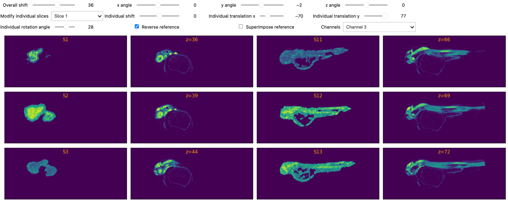

# alignment_zebrafish

A notebook to align slices acquired from MALDI imaging to a reference (manual alignment, using ipywidgets, or semi-automated registration, with itk-elastix). Voxels can then be clustered according to their expression.

Reference not in the data, available [here](https://bridges.monash.edu/ndownloader/files/25527158).
